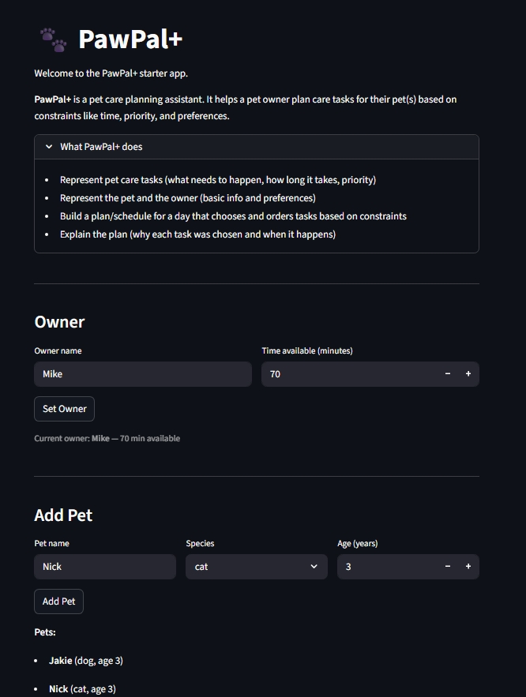
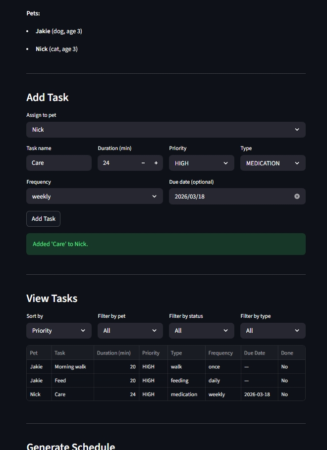

# PawPal+

A smart pet care scheduling app built with Python and Streamlit. PawPal+ helps busy pet owners plan daily care tasks across multiple pets, automatically prioritizing what matters most and flagging scheduling conflicts before they happen.

---

## Demo

<a href="app1.jpeg" target="_blank"></a>

<a href="app2.jpeg" target="_blank"></a>

---

## Features

### Smart Scheduling
- **Greedy priority scheduler** — HIGH priority tasks are always scheduled first; tasks that don't fit within the owner's time budget are skipped with an explanation
- **Shared time budget** — time is tracked across all pets so the owner's total available time is never double-counted

### Task Sorting
- **By priority** — HIGH before MEDIUM before LOW
- **By duration** — shortest tasks first, fitting more into a limited budget
- **By scheduled time** — chronological ordering for tasks with a set `HH:MM` start time

### Filtering
- **By status** — view only pending or only completed tasks
- **By type** — isolate WALK, FEEDING, MEDICATION, ENRICHMENT, or GROOMING tasks
- **By pet** — narrow any cross-pet task list to a single pet

### Recurring Tasks
Tasks support a `frequency` setting (`once`, `daily`, `weekly`). Completing a recurring task automatically creates the next occurrence with an updated due date:
- Daily → due date + 1 day
- Weekly → due date + 7 days

### Conflict Detection
Before generating a schedule, `Scheduler.detect_conflicts()` checks for:
- Total task time across all pets exceeding the owner's available time
- HIGH priority tasks alone exceeding the time budget (flags critical tasks at risk)
- Two tasks from different pets with overlapping scheduled times

All warnings are returned as plain-English strings — the app never crashes on conflicts.

---

## Project Structure

```
pawpal_system.py   # Core classes: Task, Pet, Owner, DailyPlan, Scheduler
app.py             # Streamlit UI
main.py            # CLI demo and sorting/filtering examples
tests/
  test_pawpal.py   # 18 pytest tests
requirements.txt
```

---

## Installation

**Requirements:** Python 3.10+

```bash
# 1. Clone the repo
git clone <your-repo-url>
cd pawpal

# 2. Create and activate a virtual environment
python -m venv .venv
source .venv/bin/activate      # Mac/Linux
.venv\Scripts\activate         # Windows

# 3. Install dependencies
pip install -r requirements.txt
```

---

## Running the App

```bash
streamlit run app.py
```

Open [http://localhost:8501](http://localhost:8501) in your browser.

**Workflow in the UI:**
1. Set an owner name and daily time budget (minutes)
2. Add one or more pets
3. Add tasks to each pet with priority, type, duration, frequency, and optional due date
4. Use the View Tasks panel to sort and filter the task list
5. Click **Generate Schedule** to run the scheduler — conflicts are shown as warnings before the plan

---

## Running the CLI Demo

```bash
python main.py
```

Demonstrates sorting by priority and duration, filtering by status and type, and generates a sample daily schedule.

---

## Testing

```bash
python -m pytest tests/test_pawpal.py -v
```

### Test coverage

| Area | Tests | What is verified |
|---|---|---|
| Core behavior | 2 | Task completion, adding tasks to a pet |
| Sorting | 5 | `sort_by_priority` returns HIGH before LOW; `sort_by_time` returns shortest first; neither mutates the original list |
| Recurring tasks | 6 | Daily tasks advance 1 day; weekly tasks advance 7 days; `once` tasks produce no next occurrence; missing due dates are handled safely; next occurrence inherits name, duration, and priority |
| Conflict detection | 5 | Budget overrun, HIGH-only overrun, cross-pet time overlap, empty pet edge case |

**Confidence: ★★★★☆ (4/5)**
18 tests pass across all core behaviors. Not yet covered: Streamlit UI layer, end-to-end multi-pet schedule generation, and edge cases like zero-duration tasks or duplicate task names.

---

## Class Overview

| Class | Responsibility |
|---|---|
| `Task` | A single care activity with priority, duration, type, recurrence, and due date |
| `Pet` | Owns a list of tasks; handles recurring task completion and filtering |
| `Owner` | Holds pets and the daily time budget |
| `DailyPlan` | Output of the scheduler — scheduled tasks, skipped tasks, and explanations |
| `Scheduler` | Greedy scheduling algorithm, conflict detection, sorting, and filtering |
| `Priority` | Enum: HIGH, MEDIUM, LOW |
| `TaskType` | Enum: WALK, FEEDING, MEDICATION, ENRICHMENT, GROOMING |

---

## Dependencies

| Package | Purpose |
|---|---|
| `streamlit >= 1.30` | Web UI |
| `pytest >= 7.0` | Testing |
